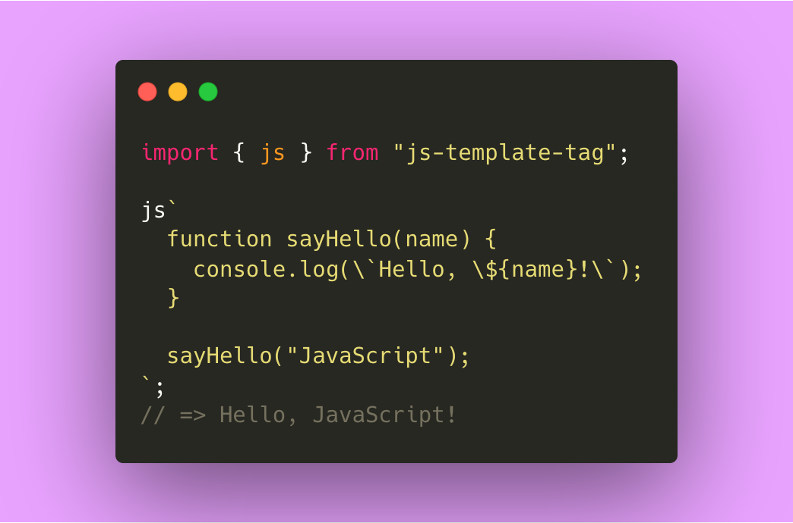

<h1 align="center">
js-template-tag
</h1>

<p align="center">

</p>

<p align="center">
<b>
JavaScript/TypeScript in JavaScript/TypeScript.
</b>
</p>

<p align="center">
<i>
Inspired by <a href="https://x.com/jallen_dev/status/1959041181788131624">x.com/jallen_dev/status/1959041181788131624</a>
</i>
</p>

## Installation

```console
$ npm install js-template-tag
```

## Usage

### JavaScript in JavaScript/TypeScript

```js
import { js } from "js-template-tag";

js`
  function sayHello(name) {
    console.log(\`Hello, \${name}!\`);
  }

  sayHello("JavaScript");
`;
// => Hello, JavaScript!
```

#### Return value

```js
import { js } from "js-template-tag";

const value = js`
  (() => "Hello, JavaScript")();
`;

console.log(value);
// => Hello, JavaScript!
```

### TypeScript in JavaScript/TypeScript

```ts
import { ts } from "js-template-tag";

ts`
  function sayHello(name: string): void {
    console.log(\`Hello, \${name}!\`);
  }

  sayHello("TypeScript");
`;
// => Hello, TypeScript!
```

#### Return value

```ts
import { ts } from "js-template-tag";

const value = ts`
  ((): string => "Hello, TypeScript!")();
`;

console.log(value);
// => Hello, TypeScript!
```

## License

[MIT](./LICENSE)
